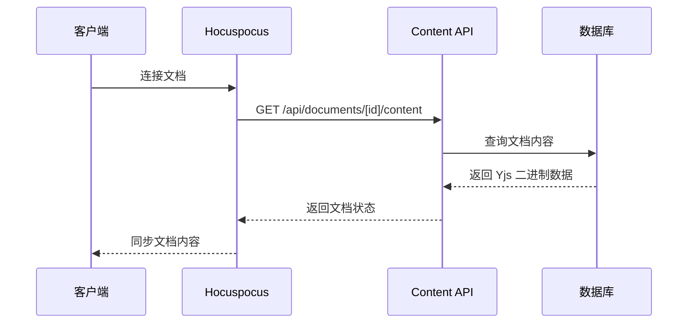

好问题！`app/api/documents/[id]/content/route.ts` 这个路由专门用于处理 **Yjs 文档的二进制内容**，它与常规的文档元数据API是分开的。让我详细解释一下：

## 🎯 主要作用

### 1. **Yjs 文档内容的直接访问**

这个路由处理的是 **Yjs 的二进制格式数据**，而不是普通的JSON或文本：

```typescript
// GET /api/documents/[id]/content
// 返回: Yjs 文档的二进制状态 (Uint8Array)

// POST /api/documents/[id]/content  
// 接收: Yjs 文档的二进制更新数据
```

### 2. **与 Hocuspocus 的配合**

```typescript
// Hocuspocus 服务器在加载文档时会调用类似的逻辑
async onLoadDocument(data) {
  // 这里的逻辑和 GET /api/documents/[id]/content 类似
  const document = await db.document.findUnique({
    where: { id: data.documentName }
  })
  
  return document?.content || null
}
```

## 🔧 具体用途

### 1. **文档冷启动加载**

当用户首次打开文档时：



### 2. **手动备份和恢复**

```typescript
// 手动备份文档
async function backupDocument(documentId: string) {
  const response = await fetch(`/api/documents/${documentId}/content`)
  const yjsData = await response.arrayBuffer()
  
  // 保存到文件或其他存储
  const blob = new Blob([yjsData], { type: 'application/octet-stream' })
  const url = URL.createObjectURL(blob)
  // 下载文件...
}

// 手动恢复文档
async function restoreDocument(documentId: string, yjsData: ArrayBuffer) {
  await fetch(`/api/documents/${documentId}/content`, {
    method: 'POST',
    body: yjsData,
    headers: {
      'Content-Type': 'application/octet-stream'
    }
  })
}
```

### 3. **文档版本管理**

```typescript
// 创建文档快照
async function createDocumentSnapshot(documentId: string) {
  const response = await fetch(`/api/documents/${documentId}/content`)
  const content = await response.arrayBuffer()
  
  // 保存快照到数据库
  await db.documentSnapshot.create({
    data: {
      documentId,
      content: Buffer.from(content),
      createdAt: new Date()
    }
  })
}
```

## 📊 数据格式对比

| 路由 | 数据类型 | 用途 |
|------|----------|------|
| `/api/documents/[id]` | JSON | 文档元数据（标题、描述、作者等） |
| `/api/documents/[id]/content` | Binary | Yjs 文档的实际内容状态 |

### 示例对比：

```typescript
// 普通文档API返回的数据
GET /api/documents/123
{
  "id": "123",
  "title": "我的文档",
  "description": "文档描述",
  "author": { "name": "张三" },
  "createdAt": "2024-01-01T00:00:00Z"
}

// 内容API返回的数据
GET /api/documents/123/content
// 返回: Uint8Array (二进制数据)
// 这个数据只有 Yjs 能理解和处理
```

## 🔄 实际使用场景

### 1. **离线同步**

```typescript
// 用户离线编辑后重新上线
async function syncOfflineChanges(documentId: string, offlineUpdates: Uint8Array) {
  // 获取服务器最新状态
  const serverState = await fetch(`/api/documents/${documentId}/content`)
  const serverData = await serverState.arrayBuffer()
  
  // 合并离线修改
  const doc = new Y.Doc()
  Y.applyUpdate(doc, new Uint8Array(serverData))
  Y.applyUpdate(doc, offlineUpdates)
  
  // 保存合并后的状态
  const mergedState = Y.encodeStateAsUpdate(doc)
  await fetch(`/api/documents/${documentId}/content`, {
    method: 'POST',
    body: mergedState
  })
}
```

### 2. **文档导入导出**

```typescript
// 导出文档
async function exportDocument(documentId: string) {
  const content = await fetch(`/api/documents/${documentId}/content`)
  const yjsData = await content.arrayBuffer()
  
  // 转换为可读格式
  const doc = new Y.Doc()
  Y.applyUpdate(doc, new Uint8Array(yjsData))
  
  const prosemirrorDoc = doc.getXmlFragment('document')
  // 转换为 Markdown/HTML/PDF 等格式
}
```

### 3. **文档分析**

```typescript
// 分析文档统计信息
async function analyzeDocument(documentId: string) {
  const content = await fetch(`/api/documents/${documentId}/content`)
  const yjsData = await content.arrayBuffer()
  
  const doc = new Y.Doc()
  Y.applyUpdate(doc, new Uint8Array(yjsData))
  
  // 统计字数、段落数等
  const stats = {
    wordCount: extractText(doc).split(' ').length,
    paragraphCount: countParagraphs(doc),
    lastModified: getLastModified(doc)
  }
}
```

## 🛡️ 安全考虑

这个路由需要严格的权限控制：

```typescript
// 检查用户是否有权限访问文档内容
export async function GET(request: NextRequest, { params }: { params: { id: string } }) {
  const session = await auth()
  if (!session?.user) {
    return Response.json({ error: '未授权' }, { status: 401 })
  }

  // 检查用户对文档的访问权限
  const hasPermission = await checkDocumentPermission(session.user.id, params.id)
  if (!hasPermission) {
    return Response.json({ error: '无权限' }, { status: 403 })
  }

  // 返回文档内容...
}
```

## 🎯 总结

`/api/documents/[id]/content` 路由是专门处理 **Yjs 二进制文档状态** 的API，主要用于：

✅ **文档冷启动** - 加载已保存的文档状态  
✅ **手动备份** - 导出/导入文档内容  
✅ **版本管理** - 创建和恢复文档快照  
✅ **离线同步** - 处理离线编辑的合并  
✅ **文档分析** - 统计和分析文档内容  

它与普通的文档元数据API形成互补，提供了对文档实际内容的底层访问能力。
