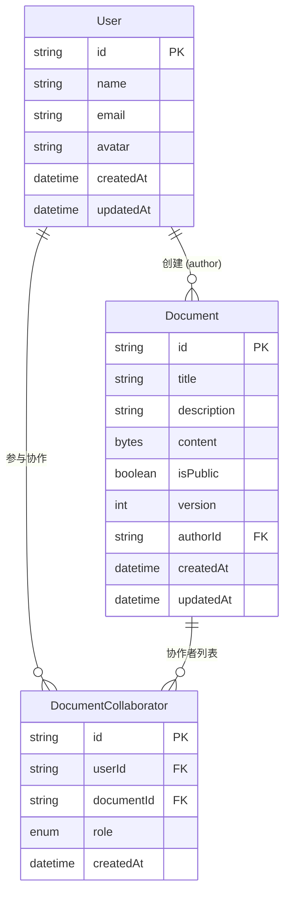

# 数据模型 - 协作关系设计详解

## 📖 概述

本文档详细解释实时协作文档系统中的协作关系设计，包括数据模型、业务逻辑和实际应用场景。

## 🏗️ 数据模型结构

### 核心模型关系图



### 关系说明

| 关系 | 类型 | 说明 |
|------|------|------|
| `User.documents` | 一对多 | 用户创建的文档 |
| `User.collaborations` | 一对多 | 用户参与的协作关系 |
| `Document.author` | 多对一 | 文档的创建者 |
| `Document.collaborators` | 一对多 | 文档的协作者列表 |

## 🤝 协作关系核心概念

### 1. 两种不同的文档关联

```typescript
model User {
  // 关系1：我创建的文档 (所有权关系)
  documents      Document[]              
  
  // 关系2：我参与的协作关系 (参与关系)  
  collaborations DocumentCollaborator[]  
}
```

**关键区别：**
- **`documents`**：我拥有的文档（创建者身份）
- **`collaborations`**：我能访问的所有文档（包括我创建的和别人邀请我的）

### 2. 中间表的必要性

**为什么需要 `DocumentCollaborator` 中间表？**

因为用户和文档之间是 **多对多关系** + **角色权限**：

```sql
-- ❌ 简单关联（无法存储角色信息）
User ←→ Document  

-- ✅ 通过中间表（可以存储角色和权限）
User ←→ DocumentCollaborator ←→ Document
         ↑ 包含角色信息 (OWNER/EDITOR/VIEWER)
```

### 3. 角色权限体系

```typescript
enum CollaboratorRole {
  OWNER    // 拥有者：完全控制权限
  EDITOR   // 编辑者：编辑文档内容  
  VIEWER   // 查看者：只读权限
}
```

| 角色 | 权限说明 |
|------|----------|
| **OWNER** | 删除文档、管理协作者、编辑内容、更改文档设置 |
| **EDITOR** | 编辑文档内容、查看文档、评论 |
| **VIEWER** | 查看文档内容、评论（只读模式） |

## 📊 实际数据示例

### 种子数据中的协作关系

根据我们的种子数据，以下是实际的协作关系：

```
👤 张三 (temp_user_001)
├── 创建的文档 (documents):
│   ├── 📄 欢迎使用协作编辑器 (doc_welcome)
│   └── 📄 项目开发计划 (doc_project_plan)
└── 参与的协作 (collaborations):
    ├── 🤝 欢迎文档 - OWNER
    └── 🤝 项目计划 - OWNER

👤 李四 (temp_user_002)  
├── 创建的文档 (documents):
│   └── 📄 团队会议纪要 (doc_meeting_notes)
└── 参与的协作 (collaborations):
    ├── 🤝 会议纪要 - OWNER
    └── 🤝 项目计划 - EDITOR  ← 被张三邀请

👤 王五 (temp_user_003)
├── 创建的文档 (documents):
│   └── 📄 API 接口文档 (doc_api_docs)
└── 参与的协作 (collaborations):
    ├── 🤝 API 文档 - OWNER
    └── 🤝 欢迎文档 - VIEWER  ← 被张三邀请
```

### 具体协作场景分析

**📄 "项目开发计划" 文档的协作情况：**

```typescript
{
  title: "项目开发计划",
  author: "张三",
  collaborators: [
    { user: "张三", role: "OWNER" },    // 创建者自动成为拥有者
    { user: "李四", role: "EDITOR" }    // 被邀请的编辑者
  ]
}
```

**权限结果：**
- ✅ 张三：可以删除文档、邀请/移除协作者、编辑内容
- ✅ 李四：可以编辑文档内容、查看文档
- ❌ 王五：无法访问（不在协作者列表中）

## 🔧 业务逻辑实现

### 1. 创建文档时的协作关系

```typescript
async function createDocument(authorId: string, data: DocumentData) {
  // 1. 创建文档
  const document = await prisma.document.create({
    data: {
      ...data,
      authorId
    }
  })
  
  // 2. 自动创建拥有者协作关系
  await prisma.documentCollaborator.create({
    data: {
      userId: authorId,
      documentId: document.id,
      role: 'OWNER'
    }
  })
  
  return document
}
```

### 2. 邀请协作者

```typescript
async function inviteCollaborator(
  documentId: string, 
  inviterId: string, 
  inviteeId: string, 
  role: 'EDITOR' | 'VIEWER'
) {
  // 1. 验证邀请者权限
  const inviterCollab = await prisma.documentCollaborator.findFirst({
    where: {
      documentId,
      userId: inviterId,
      role: 'OWNER'  // 只有拥有者可以邀请
    }
  })
  
  if (!inviterCollab) {
    throw new Error('无权限邀请协作者')
  }
  
  // 2. 创建协作关系
  return await prisma.documentCollaborator.create({
    data: {
      userId: inviteeId,
      documentId,
      role
    }
  })
}
```

### 3. 权限检查函数

```typescript
// 检查编辑权限
async function canEditDocument(userId: string, documentId: string): Promise<boolean> {
  const collaboration = await prisma.documentCollaborator.findFirst({
    where: {
      userId,
      documentId,
      role: { in: ['OWNER', 'EDITOR'] }
    }
  })
  
  return !!collaboration
}

// 检查查看权限  
async function canViewDocument(userId: string, documentId: string): Promise<boolean> {
  // 1. 检查是否有协作权限
  const collaboration = await prisma.documentCollaborator.findFirst({
    where: { userId, documentId }
  })
  
  if (collaboration) return true
  
  // 2. 检查是否为公开文档
  const document = await prisma.document.findFirst({
    where: { id: documentId, isPublic: true }
  })
  
  return !!document
}

// 检查管理权限
async function canManageDocument(userId: string, documentId: string): Promise<boolean> {
  const collaboration = await prisma.documentCollaborator.findFirst({
    where: {
      userId,
      documentId,
      role: 'OWNER'
    }
  })
  
  return !!collaboration
}
```

## 🔍 常用查询模式

### 1. 获取用户可访问的所有文档

```typescript
async function getUserAccessibleDocuments(userId: string) {
  const user = await prisma.user.findUnique({
    where: { id: userId },
    include: {
      collaborations: {
        include: {
          document: {
            include: {
              author: { select: { id: true, name: true } },
              _count: { select: { collaborators: true } }
            }
          }
        }
      }
    }
  })
  
  // 返回用户有权限访问的所有文档
  return user?.collaborations.map(collab => ({
    ...collab.document,
    myRole: collab.role
  })) || []
}
```

### 2. 获取文档的所有协作者

```typescript
async function getDocumentCollaborators(documentId: string) {
  return await prisma.documentCollaborator.findMany({
    where: { documentId },
    include: {
      user: {
        select: { id: true, name: true, email: true, avatar: true }
      }
    },
    orderBy: [
      { role: 'asc' },  // OWNER 优先
      { createdAt: 'asc' }
    ]
  })
}
```

### 3. 检查用户在特定文档中的角色

```typescript
async function getUserRoleInDocument(userId: string, documentId: string) {
  const collaboration = await prisma.documentCollaborator.findFirst({
    where: { userId, documentId },
    select: { role: true }
  })
  
  return collaboration?.role || null
}
```

## ⚡ 性能优化建议

### 1. 数据库索引

```sql
-- 协作关系查询优化
CREATE INDEX idx_collaborator_user_doc ON document_collaborators(userId, documentId);
CREATE INDEX idx_collaborator_doc ON document_collaborators(documentId);
CREATE INDEX idx_collaborator_user ON document_collaborators(userId);

-- 文档查询优化
CREATE INDEX idx_document_author ON documents(authorId);
CREATE INDEX idx_document_public ON documents(isPublic);
```

### 2. 查询优化

```typescript
// ✅ 好的做法：使用 include 减少查询次数
const userWithDocs = await prisma.user.findUnique({
  where: { id: userId },
  include: {
    collaborations: {
      include: { document: true }
    }
  }
})

// ❌ 避免：N+1 查询问题
const collaborations = await prisma.documentCollaborator.findMany({
  where: { userId }
})
for (const collab of collaborations) {
  const document = await prisma.document.findUnique({
    where: { id: collab.documentId }
  })
}
```

## 🚨 注意事项和限制

### 1. 数据一致性

- **文档作者必须是 OWNER**：确保 `Document.authorId` 对应的用户在 `DocumentCollaborator` 中有 OWNER 角色
- **唯一性约束**：一个用户在一个文档中只能有一个角色
- **级联删除**：删除用户或文档时，相关的协作关系会自动删除

### 2. 业务规则

- **至少一个 OWNER**：每个文档必须至少有一个 OWNER
- **OWNER 权限**：只有 OWNER 可以删除文档或管理其他协作者
- **角色变更**：可以更改协作者角色，但不能移除最后一个 OWNER

### 3. 扩展性考虑

当前设计支持未来扩展：
- **团队权限**：可以添加 Team 模型，实现基于团队的权限管理
- **细粒度权限**：可以扩展角色系统，添加更多权限粒度
- **权限继承**：可以实现文档夹级别的权限继承

## 📝 总结

协作关系设计的核心思想：
1. **清晰的角色权限**：OWNER/EDITOR/VIEWER 三级权限体系
2. **灵活的多对多关系**：通过中间表实现复杂的协作场景
3. **数据一致性保证**：通过约束和级联删除确保数据完整性
4. **高效的查询模式**：优化的索引和查询策略
5. **良好的扩展性**：支持未来功能扩展

这种设计能够满足大多数协作文档系统的需求，同时保持代码的简洁性和可维护性。 